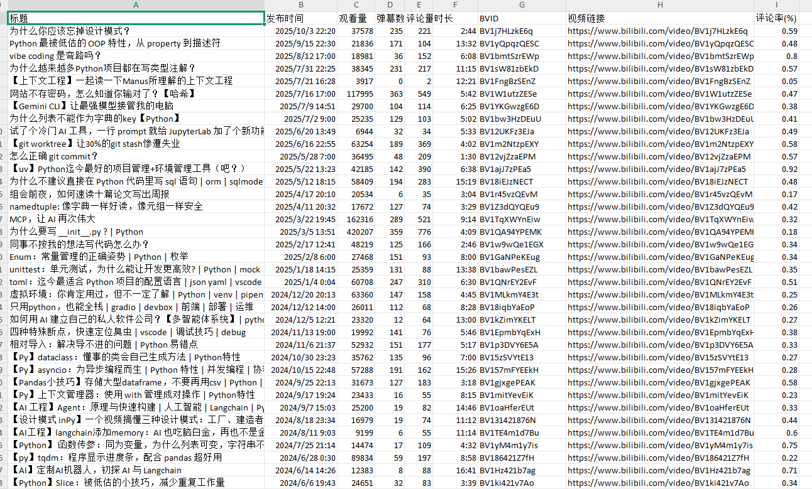

# 免费的B站UP主数据分析插件

这是一款免费、开源的Chrome浏览器插件，专为B站UP主、内容创作者和数据分析师设计。它可以一键抓取并导出指定UP主的所有视频数据为CSV文件，帮助您轻松进行内容分析、选题研究和数据复盘，完全替代昂贵的付费分析工具。

## ✨ 功能特性

* **一键导出**：只需一次点击，即可获取UP主的所有视频数据。

* **数据全面**：涵盖标题、发布时间、观看量、弹幕数、评论数、BVID、视频链接等。

* **自动计算**：自动生成`评论率`等关键互动指标，帮助洞察内容质量。

* **CSV格式**：导出为通用的CSV表格，方便在Excel、Numbers或Python中进行深度分析。

* **智能认证**：无需手动配置，自动利用浏览器登录状态完成B站API认证。

* **完全免费 & 开源**：纯粹为爱发电，无任何功能限制或费用。

## 🎬 功能截图

## 🚀 安装指南

本插件未在Chrome商店上架，需要通过开发者模式手动加载。

1. **下载项目**

   * 点击本页面右上角的 `Code` -> `Download ZIP`，下载项目并解压到你喜欢的文件夹。

   * 或者，如果你熟悉Git，可以执行 `git clone https://github.com/abc-kkk/bilibili-data-ana.git`

2. **加载插件**

   * 打开Chrome浏览器，在地址栏输入 `chrome://extensions` 并回车。

   * 在页面右上角，找到并打开 **“开发者模式”** 的开关。

   * 点击左上角的 **“加载已解压的扩展程序”** 按钮。

   * 在弹出的文件选择窗口中，选择你刚刚解压的**整个插件文件夹**。

   * 安装成功！你会在浏览器右上角看到插件的图标。

## 💡 如何使用

1. 确保你已经在Chrome浏览器中登录了你的B站账号。

2. 访问任意一个你想分析的B站UP主的个人空间（例如：`https://space.bilibili.com/xxxxxxxx`）。

3. 点击浏览器右上角的插件图标，会弹出一个小窗口。

4. 在弹窗中点击 **“分析数据”** 按钮。

5. 等待分析完成（如果UP主视频多，可能需要几十秒），窗口会提示找到的视频数量。

6. 点击 **“下载CSV文件”** 按钮，即可将包含所有数据的表格保存到本地。

## 🤝 贡献与反馈

欢迎提出宝贵的意见和建议！如果你发现了Bug，或者有新的功能想法，请在 [Issues](https://github.com/abc-kkk/bilibili-data-ana.git/issues) 页面提出。

当然，也欢迎你 Fork 本项目并提交 Pull Request，一起让这个小工具变得更好！

## 📄 许可证

本项目采用 [MIT License](LICENSE) 开源。